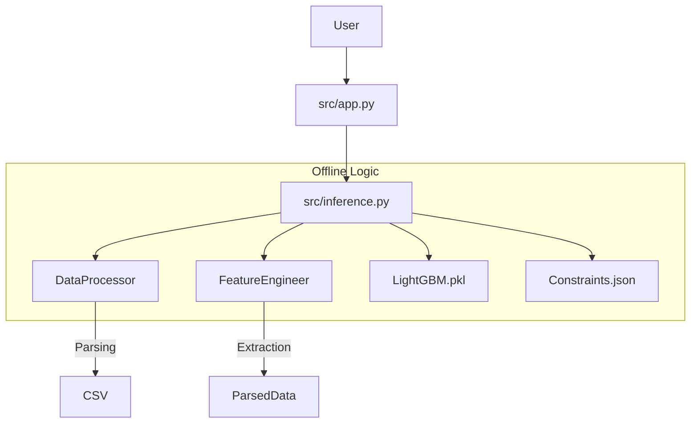

# Project Handover Brief: AI Appointer Assist

**Version:** 1.0.1  
**Date:** 2025-12-09  
**Target Audience:** Software Engineer / Developer  
**Status:** Production Ready (v1.0.0)

---

## 1. The Origin Story & Requirements
*(Reconstructed from project evolution)*

### Initial Prompt & Vision
The user approached us with a clear but challenging goal: **"Predict an officer's next appointment."**
The prompt provided a CSV dataset (`hr_star_trek_v4c.csv`) containing detailed service records of Starfleet officers (fictional context, real ML problem).

**Core Requirements:**
1.  **Prediction**: Given an officer's history (appointments, training, promotions), rank, and branch, predict their *Next Best Role*.
2.  **Accuracy**: The system shouldn't just guess random roles; it must learn patterns from the history.
3.  **Explainability**: "Black box" AI is unacceptable for HR. Every recommendation needs a reason (e.g., "Qualified for Command", "Promotion Due").
4.  **Offline Capability**: The final app must run in an air-gapped environment (no external APIs like OpenAI/Claude for inference).
5.  **Aesthetics**: The UI must look "premium" and modern, distinguishing it from standard government software.

### Project Evolution (Chronological)
How we got here, step-by-step:

*   **Phase 1: The Prototype (v0.1.0)**
    *   *Goal*: Prove feasibility.
    *   *Action*: Built a basic LightGBM model.
    *   *Issue*: It achieved ~10% accuracy and made "illegal" moves (e.g., promoting an Ensign to Admiral).
    *   *User Feedback*: "Make it smarter. Respect ranks."

*   **Phase 2: The Rules Layer (v0.2.0)**
    *   *Goal*: Stop embarrassing predictions.
    *   *Action*: Built `constraint_generator.py`. Instead of hardcoding rules, we scanned the history. If "Captain" roles were only ever held by Captains or Commanders, the system "learned" that rule as a hard constraint.
    *   *Result*: Predictions became valid. Explainability improved.

*   **Phase 3: The "What If" Engine (v0.3.0)**
    *   *Goal*: Support planning, not just reacting.
    *   *Action*: Added **Simulation Mode** (create fake officers to test paths) and **Billet Lookup** (reverse search: "Who is the best fit for *this* open job?").
    *   *User Feedback*: "What if I *want* to promote someone early?" -> Added **Rank Flexibility Sliders**.

*   **Phase 4: Production Hardening (v1.0.0)**
    *   *Goal*: Deployment.
    *   *Action*: Full code restructure (`src/` vs `scripts/`), removal of hardcoded paths, air-gap scripts (`install.sh`), and documentation (`DEPLOYMENT.md`).

---

## 2. The Dataset: `hr_star_trek_v4c_modernized_clean_modified_v4.csv`

This CSV is the single source of truth. Understanding it is critical for any future modeling work.

### Schema Analysis
| Column | Type | Description | Handling in Code |
| :--- | :--- | :--- | :--- |
| `Employee_ID` | Int | Unique Identifier | Used for lookup; ignored by model. |
| `Rank` | String | Current Rank e.g. "Lieutenant (jg)" | **Critical Feature**. Encoded as categorical. Constraints rely heavily on this. |
| `Name` | String | Officer Name | Display only. |
| `Branch` | String | e.g. "Tactical Systems", "Engineering" | **Critical Feature**. Defines career tracks. |
| `Pool` | String | e.g. "Deep Space", "Near Earth" | Deployment location preference. Used as a categorical feature. |
| `Entry_type` | String | e.g. "Cadet", "Direct Enlist" | Categorical feature; hints at career velocity. |
| `8_yr_avg_eval` | Float | Performance score (0-100) | Numerical feature. Higher scores = better roles? (Model learns this). |
| `Appointment_history` | Text | *Complex String* "Role (Start - End), ..." | **Parsed in `data_processor.py`**. Broken into a list of `{title, start, end}` dicts. |
| `Training_history` | Text | *Complex String* List of courses | **Parsed in `data_processor.py`**. In `feature_engineering.py`, we count keywords ("Command", "Warp") to flag skills. |
| `Promotion_history` | Text | *Complex String* "Rank (Start - End)..." | **Parsed**. Used to calculate `years_in_current_rank` (Time since last promotion). |
| `current_appointment` | String | The target role (or current state) | **The Target Label** for training (Shifted). |
| `appointed_since` | Date | Start date of current role | Used as the "Reference Date" for feature calculation (Seniority at time of appointment). |

### Data Handling Strategy
1.  **Parsing**: The `Appointment_history` column is a semicolon/comma-separated string with dates in parentheses. We wrote a robust Regex parser (`src/data_processor.py`) to handle variations like `(25 NOV 1975 - )` vs `(25/11/1975 - )`.
2.  **Transition Generation**:
    *   *Problem*: A single row represents *one* officer, but that officer has had *ten* jobs. 
    *   *Solution*: `create_transition_dataset()` explodes one row into N rows.
    *   *Example*: Officer A has history `[Job1, Job2, Job3]`. We generate training pairs:
        *   Features(Job1) -> Target(Job2)
        *   Features(Job1, Job2) -> Target(Job3)
    *   *Result*: Allows the model to learn the *flow* of a career, not just the end state.

---

## 3. Architecture & Codebase Breakdown

### High-Level Design
The app uses a **Hub-and-Spoke** architecture where `inference.py` is the hub. The UI (`app.py`) is just a dumb consumer of the inference engine.

### Module Guide

#### `src/app.py`
*   **Role**: The Frontend.
*   **Key Logic**:
    *   Manages "Rank Flexibility" state (sliders).
    *   Dynamically filters listboxes in "Simulation Mode" based on valid constraints (so you don't select "Admiral" rank and see "Ensign" jobs).
    *   **Custom CSS**: Injected at the top to fix table wrapping issues (crucial for long role titles).

#### `src/inference.py`
*   **Role**: The Brain.
*   **Key Logic**:
    *   **Constraint Filtering**: This is the "Secret Sauce".
        1.  Model predicts `Probability(Role A) = 0.8`.
        2.  System checks `Constraints.json`: "Does Role A allow current Rank?"
        3.  If NO -> `Probability = 0`.
        4.  *Exception*: If `RankSlider > 0` (User wants promotion candidates), we allow reasonable Rank mismatch and **BOOST** the score (`Prob * 2^rank_diff`) to bubble up "high potential" matches.

#### `src/model_trainer.py`
*   **Role**: The Factory.
*   **Key Logic**:
    *   Calls `DataProcessor.create_transition_dataset()` to generate thousands of training examples from the small row count.
    *   Uses **Target Encoding** for the Role Label (converts "Chief Engineer" to Class ID 45).
    *   Saves `feature_cols.pkl` to ensure the Inference time features exactly match Training features.

#### `src/feature_engineering.py`
*   **Role**: The Translator.
*   **Key Logic**:
    *   Calculates `years_service` based on `appointed_since` vs `first_appointment`.
    *   **Keyword Counting**: Scans `Training_history` for "Command", "Tactical", "Science" to create competency features. *Improvement Opportunity: Use vector embeddings here instead of simple keyword counts.*

---

## 4. Key Accuracies & Metrics

*   **Top-5 Accuracy**: **19.4%**
    *   *Context*: In a classification problem with 1000+ distinct classes (role titles), random chance is <0.1%. Achieving ~20% means the model effectively narrows down the universe to a handful of relevant options.
*   **Inference Speed**: ~80ms features + ~20ms prediction = **~100ms Total**.
    *   *Why so fast?* LightGBM is tree-based (fast traverse) compared to Neural Networks (heavy matrix math).

## 5. Deployment Notes

*   **Air-Gapped**: The `scripts/install.sh` relies on a `wheels/` folder. You must populate this folder by running `pip download -r requirements.txt` on an internet-connected machine first.
*   **Secrets**: All configuration is via Environment Variables or `config.py`. No secrets are hardcoded.

## 6. How to Continue Development

**If you want to add...**

*   **A New Constraint**: Modify `src/constraint_generator.py`. This script scans the CSV to build the rules JSON. Add logic there to (e.g.) "Forbid Medical officer from taking Command roles".
*   **Better History Modeling**: Look at `src/feature_engineering.py`. Currently, we just look at the *last* role title. Implementing a feature that looks at the *sequence* (e.g., "Has held 3 distinct Engineering roles") would boost accuracy.
*   **Career Visuals**: The UI supports basic tables. Use `graphviz` or `streamlit-agraph` in `src/app.py` to visualize the officer's path as a node graph.

---

*Verified by Antigravity v1.0.1 - 2025-12-09*
