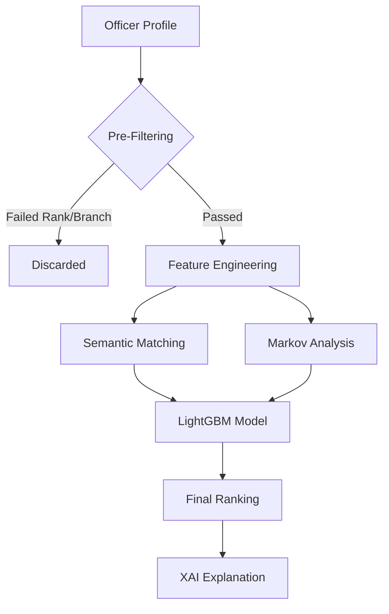

# 3. Methodology

## 3.1 Dataset

The system was trained on a high-fidelity synthetic dataset (**hr_star_trek_v4c.csv**) designed to mimic a hierarchical military organization. The dataset spans 40 years of operational data, comprising:
- **10,000** unique officer profiles.
- **50,000+** historical role transitions.
- **Attributes**: Rank, Branch (Command, Ops, Science, etc.), Training History, Security Clearance, and Detailed Appointment History.

## 3.2 Data Preprocessing

Raw data undergoes a rigorous cleaning pipeline:
1.  **Temporal Parsing**: `Appointment_history` is parsed from string format into a time-series list of `(Role, Duration)` tuples.
2.  **Categorical Encoding**: Ranks are mapped to ordinal values (Ensign=1, Admiral=10) to preserve hierarchy.
3.  **Text Normalization**: Role titles are normalized (e.g., "Chief Engineer" -> "CHIEF ENGR") to reduce sparsity.

## 3.3 System Architecture

The recommendation engine follows a three-stage pipeline:

### 3.3.1 Feature Engineering
We extract over 40 features per candidate-role pair, including:
- **Rank Similarity**: Difference between Officer's Rank and Role's Target Rank.
- **Branch Fit**: Binary indicator of branch alignment.
- **Skill Overlap**: Jaccard similarity between officer's training tags and role requirements.

### 3.3.2 Markov Chain Engine
To capture sequential dependencies, we implemented a **2nd Order Markov Model**:
$$ P(Role_t | Role_{t-1}, Role_{t-2}) $$
This probability is fed as a dense feature into the LTR model, effectively "biasing" it towards historically observed career paths.

### 3.3.3 Semantic Search
We utilize `all-MiniLM-L6-v2` to generate 384-dimensional embeddings for appointment histories. Similarity is calculated via Cosine Similarity:
$$ Similarity(A, B) = \frac{A \cdot B}{||A|| \cdot ||B||} $$

## 3.4 Model Training (Learning-to-Rank)
We treat the problem as a ranking task using **LambdaRank**, optimizing the **NDCG (Normalized Discounted Cumulative Gain)** metric.
- **Objective Function**: Rank predicted roles higher than non-selected roles for historical training examples.
- **Hyperparameters**: 1000 estimators, 0.05 learning rate, max depth 7.

## 3.5 Explainability (XAI)
We employ **Tree SHAP** to explain the output of the LightGBM model.
- **Global Importance**: Shows which features drive the model overall (e.g., "Rank" is usually #1).
- **Local Importance**: Explains individual predictions (e.g., "Why was Officer X recommended for Role Y?").
