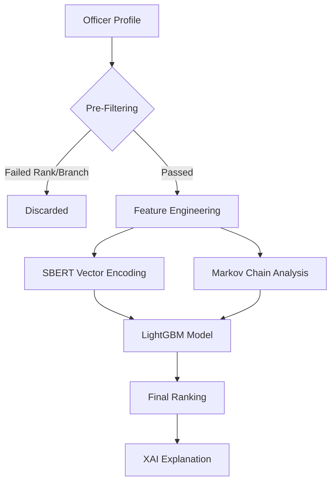

# 3. Methodology

## 3.1 Dataset

The system was trained on a specialized synthetic dataset (**hr_star_trek_v4c.csv**) designed to mimic a hierarchical technical organization. The dataset contains high-fidelity operational data, comprising:
- **1,411** unique officer profiles (Active Service).
- **1,409** unique roles across the fleet.
- **Attributes**: 
    - **Ranks**: 7 distinct tiers (Lieutenant (jg) to Rear Admiral).
    - **Branches**: 4 core specializations (Tactical Systems, Engineering, Hull Systems, Science).
    - **History**: Detailed time-series logs of appointments and training courses.

## 3.2 Data Preprocessing

Raw data undergoes a rigorous cleaning pipeline:
1.  **Temporal Parsing**: `Appointment_history` is parsed from string format (e.g., "Div Officer CS Horizon / Post 1 (15 JUN 2019 - )") into structured time-series data.
2.  **Categorical Encoding**: Ranks are mapped to ordinal values (Lt (jg)=1 to Admiral=7) to preserve hierarchy.
3.  **Text Normalization**: Role titles are normalized (e.g., "Asst Manager" -> "ASST MGR") to reduce sparsity while retaining semantic meaning.

## 3.3 System Architecture

The recommendation engine follows a three-stage pipeline (updated v4.1):

### 3.3.1 Feature Engineering
We extract over 40 features per candidate-role pair, including:
- **Rank Similarity**: Difference between Officer's Rank and Role's Target Rank.
- **Branch Fit**: Binary indicator of branch alignment (e.g., Engineer $\rightarrow$ Engineering Role).
- **Skill Overlap**: Jaccard similarity between officer's training tags (e.g., "Warp Tech Course") and role requirements.

### 3.3.2 Markov Chain Engine
To capture sequential dependencies, we implemented a **2nd Order Markov Model**:
$$ P(Role_t | Role_{t-1}, Role_{t-2}) $$
This probability is fed as a dense feature into the LTR model, effectively "biasing" it towards historically observed career paths (e.g., Div Officer $\rightarrow$ Dept Head).

### 3.3.3 Semantic Search (v4.1)
We employ a **Hybrid Search Engine** using **Sentence-BERT (SBERT)**:
1.  **Vector Encoding**: `all-MiniLM-L6-v2` generates 384-dimensional embeddings for officer resumes (Appointment + Training history).
2.  **Indexing**: Embeddings are indexed for fast cosine similarity retrieval.
3.  **Hybrid Query**: 
    $$ Score = \alpha \cdot \text{VectorSim}(q, d) + \beta \cdot \text{KeywordMatch}(q, d) $$
    This allows the system to find "Leadership roles" even if the specific word "Leadership" is missing, while respecting specific constraints like "NOT Staff".

## 3.4 Model Training (Learning-to-Rank)
We treat the problem as a ranking task using **LambdaRank**, optimizing the **NDCG (Normalized Discounted Cumulative Gain)** metric.
- **Objective Function**: Rank predicted roles higher than non-selected roles for historical training examples.
- **Hyperparameters**: 1000 estimators, 0.05 learning rate, max depth 7.

## 3.5 Explainability (XAI)
We employ **Tree SHAP** to explain the output of the LightGBM model.
- **Global Importance**: Shows which features drive the model overall (e.g., "Rank" is usually #1).
- **Local Importance**: Explains individual predictions (e.g., "Why was Officer X recommended for Role Y?").
