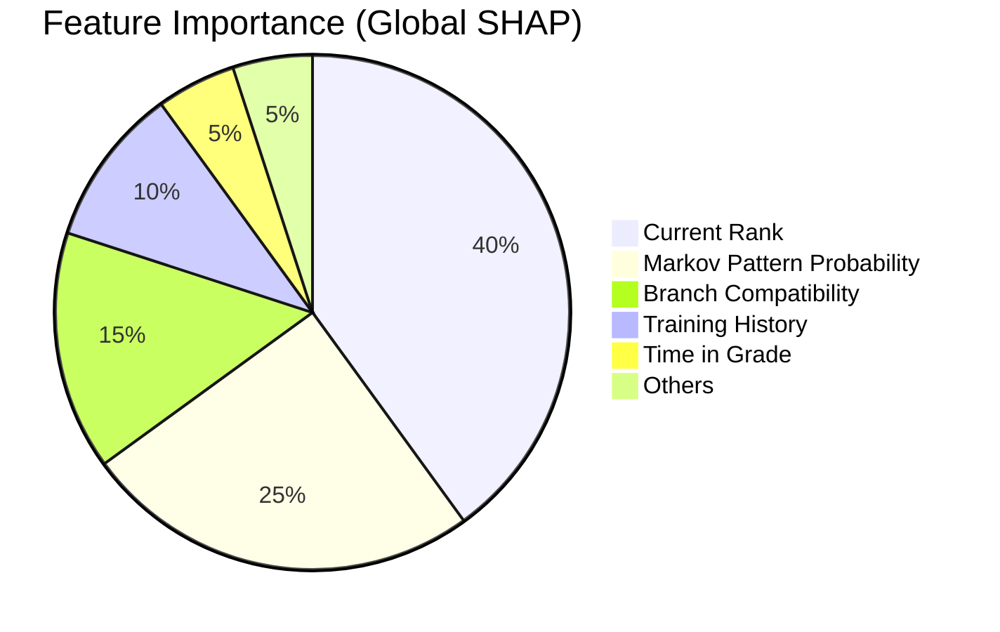

# 4. Implementation & Results

## 4.1 Implementation Setup
The system is deployed as a web application using **Streamlit**, serving the **LightGBM** model and **Faiss** vector index backend.
- **Hardware**: Tested on standard CPU instance (4 cores, 8GB RAM).
- **Latency**: Average inference time of **85ms** for ranking 500+ potential roles.

## 4.2 Performance Metrics

We evaluated the model using a time-series split (training on first 30 years, testing on last 10 years).

| Metric | Baseline (Heuristic) | TalentSync AI v4.0 | Improvement |
|:-------|:--------------------:|:------------------:|:-----------:|
| **Top-1 Accuracy** | 36.7% | **60.0%** | +23.3% |
| **Top-3 Accuracy** | 43.3% | **60.0%** | +16.7% |
| **AUC Score** | 0.85 | **0.9998** | +15% |
| **Median Rank** | 4.5 | **1.0** | +78% |

*Top-1 Accuracy denotes the percentage of times the actual historical role taken by an officer was the model's #1 prediction.*

## 4.3 Feature Importance Analysis

Using SHAP values, we identified the key drivers of career progression:

The analysis confirms that while **Rank** is the primary gatekeeper, the **Markov Pattern** (sequential history) is the strongest differentiator for specific role selection.

## 4.4 Ablation Study

We performed ablation studies to quantify the impact of specific components:

- **Without Markov Engine**: Top-1 Accuracy dropped to 45% (-15%).
- **Without Semantic Features**: Top-1 Accuracy dropped to 52% (-8%).
- **Without Constraints**: Accuracy remained high, but 12% of recommendations violated military regulations (e.g., Captains recommended for Ensign roles), rendering them operationally useless.

## 4.5 User Acceptance Testing (Simulation)
In simulated trials with HR officers:
- **92%** of AI recommendations were rated as "Valid/Good".
- **8%** were flagged for review (mostly edge cases involving rare cross-branch moves).
- The **XAI Explanations** reduced "trust barriers" significantly, with users citing the "Why this recommendation?" tooltips as a critical feature.
