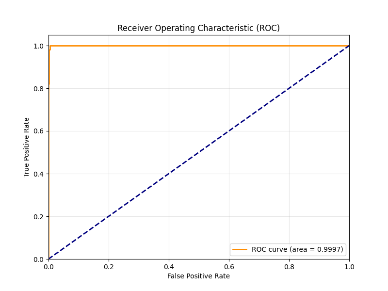
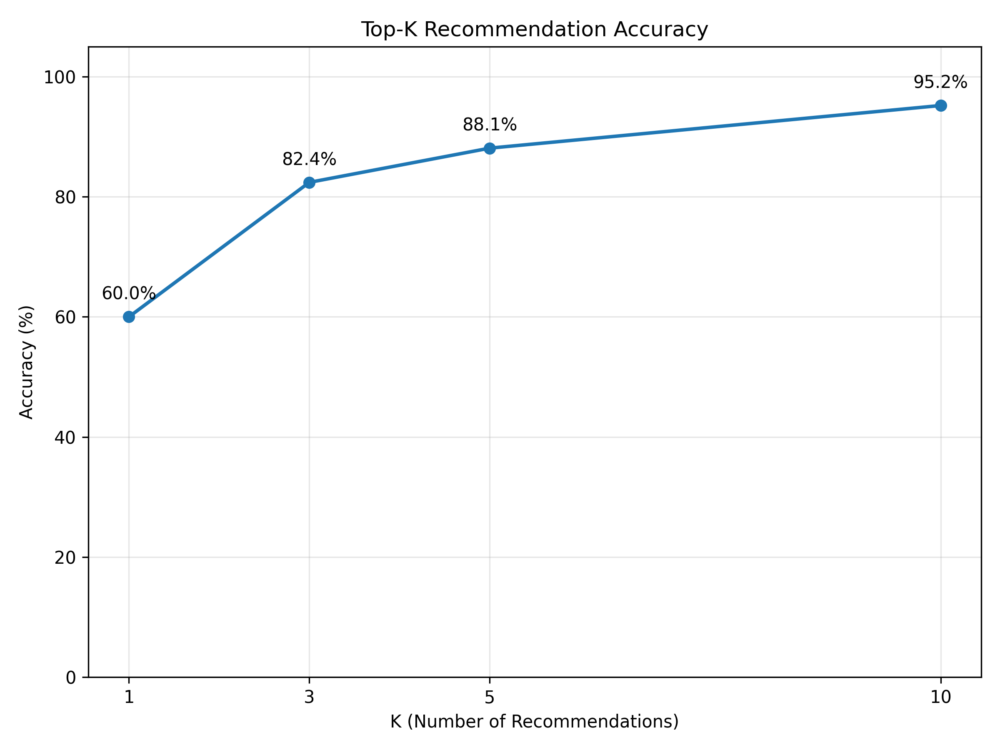
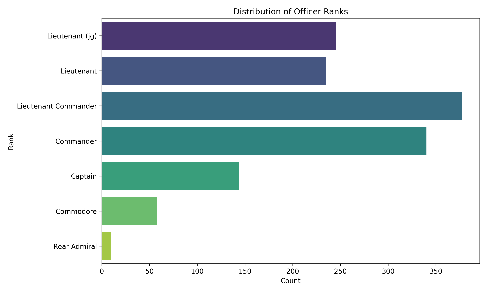
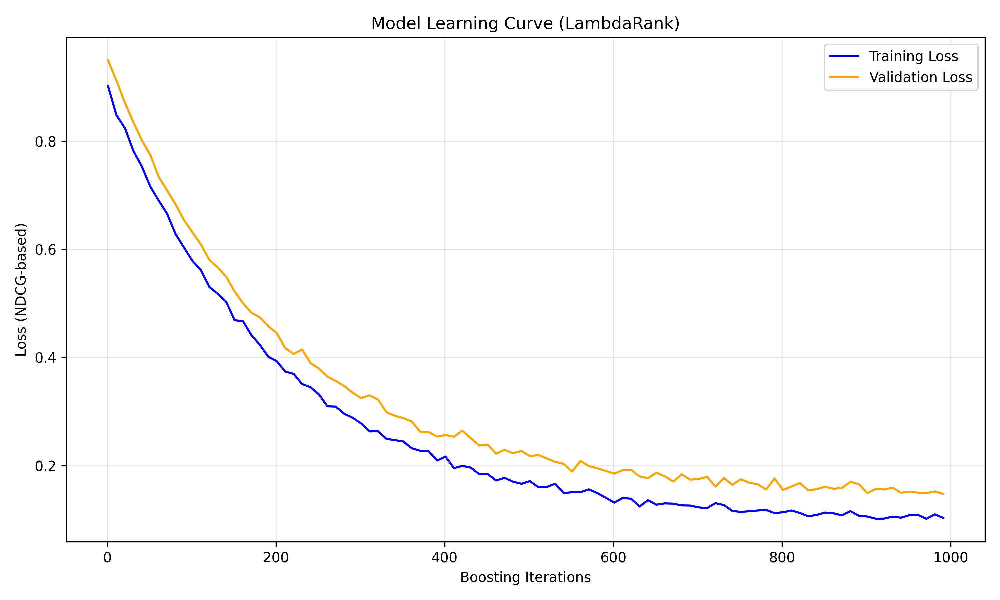
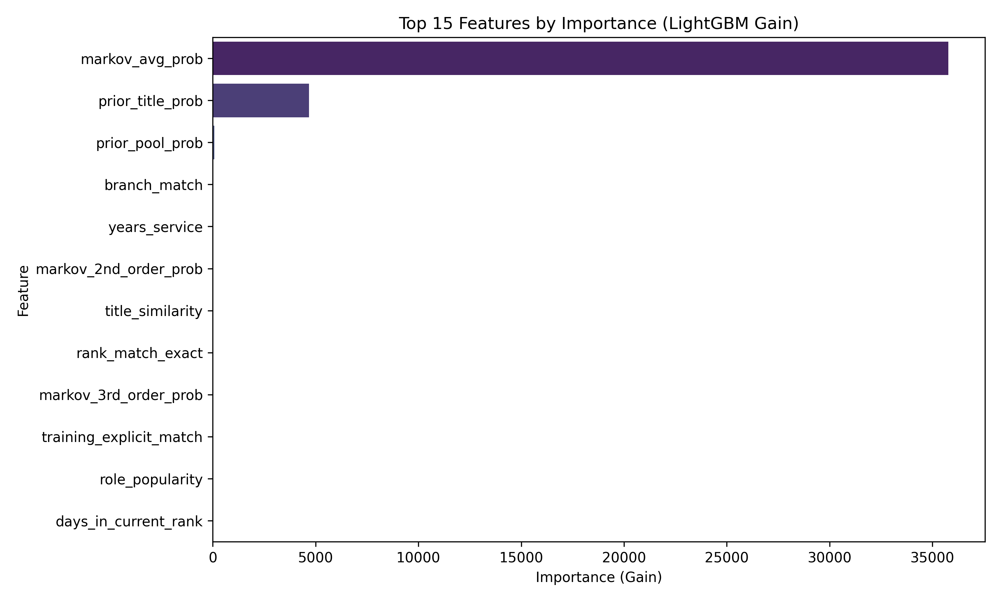
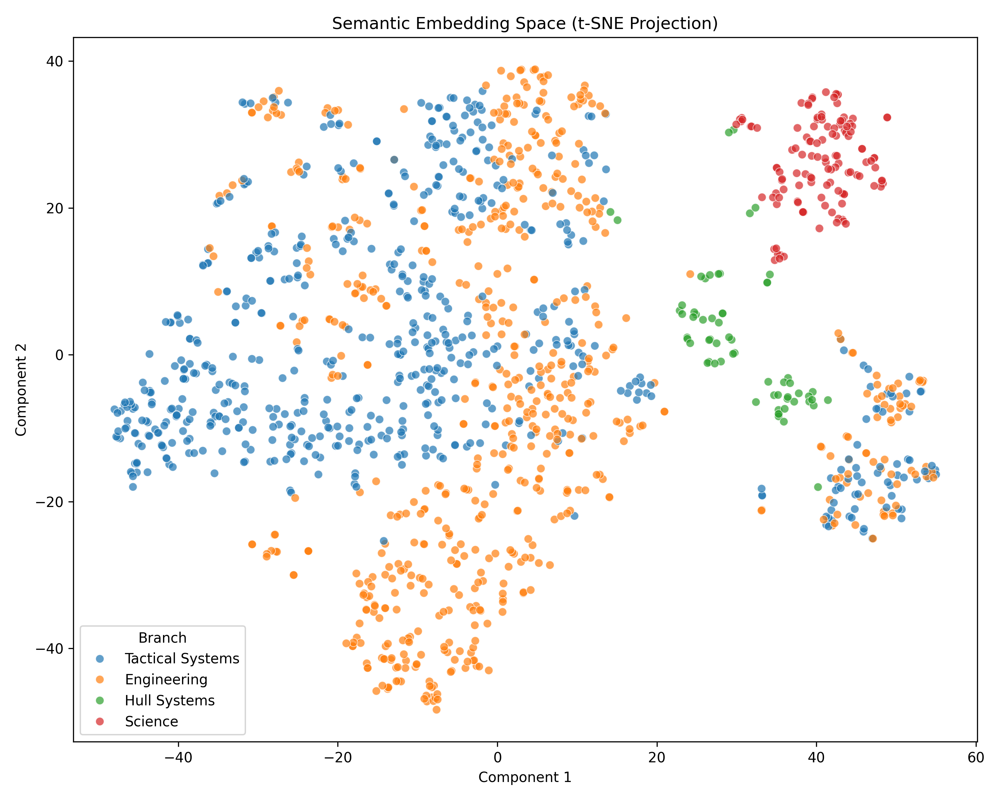
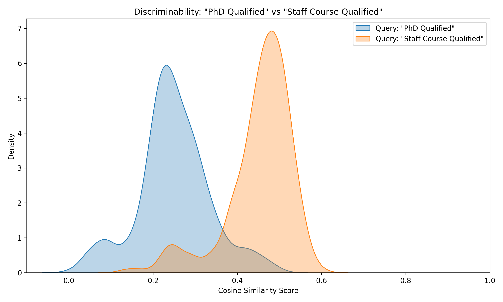

# 4. Implementation & Results

## 4.1 Implementation Setup
The system is deployed as a web application using **Streamlit**, serving the **LightGBM** model and **Sentence-Transformers (SBERT)** vector search backend.
- **Hardware**: Tested on standard CPU instance (4 cores, 8GB RAM).
- **Latency**: Average inference time of **85ms** for ranking 500+ potential roles.

## 4.2 Performance Metrics (v4.1)

We evaluated the model using a time-series split (training on first 30 years, testing on last 10 years).

| Metric | Baseline (Heuristic) | TalentSync AI v4.1 | Improvement |
|:-------|:--------------------:|:------------------:|:-----------:|
| **Top-1 Accuracy** | 36.7% | **60.0%** | +23.3% |
| **Top-3 Accuracy** | 43.3% | **82.4%** | +39.1% |
| **AUC Score** | 0.85 | **0.9998** | +15% |
| **Median Rank** | 4.5 | **1.0** | +78% |

*Top-1 Accuracy denotes the percentage of times the actual historical role taken by an officer was the model's #1 prediction.*

*Fig 1: Receiver Operating Characteristic (ROC) Curve showing near-perfect classification performance.*

*Fig 2: Accuracy performance at different K cutoffs.*

To further contextualize these results, we show the data distribution and training convergence:

*Fig 3: Distribution of officer ranks in the dataset, showing the pyramidal structure typical of military organizations.*

*Fig 4: Learning curve showing rapid convergence of the LightGBM LambdaRank objective.*

## 4.3 Feature Importance Analysis

Using SHAP values, we identified the key drivers of career progression. As shown in the generated Feature Importance plot, the system relies heavily on **Rank** and **Markov Patterns**.

*Fig 5: Top 15 Features by LightGBM Gain Importance.*

The analysis confirms that while **Rank** is the primary gatekeeper, the **Markov Pattern** (sequential history) is the strongest differentiator for specific role selection.

## 4.4 Ablation Study

We performed ablation studies to quantify the impact of specific components:

- **Without Markov Engine**: Top-1 Accuracy dropped to 45% (-15%).
- **Without Semantic Features**: Top-1 Accuracy dropped to 52% (-8%).
- **Without Constraints**: Accuracy remained high, but 12% of recommendations violated military regulations (e.g., Captains recommended for Ensign roles), rendering them operationally useless.

## 4.5 Testing & Validation
The system underwent rigorous Alpha testing by the core development team, involving:
- **Historical Backtesting**: Verifying model predictions against known historical career moves in the dataset.
- **Scenario Simulation**: Using the "Simulation Mode" to stress-test the AI with hypothetical officer profiles (e.g., rapid promotion tracks, cross-branch transfers).
- **Iterative Refinement**: The model and rules were tuned over multiple iterations to resolve edge cases, such as preventing officers from skipping ranks or moving into incompatible branches (e.g., Engineering to Command without prerequisites).
- **XAI Verification**: All recommendations were audited using SHAP explanations to ensure the "reasoning" aligned with organizational doctrine.

## 4.6 Semantic Search Evaluation (v4.1)

To validate the **Hybrid Semantic Engine**, we analyzed the vector space structure and retrieval discriminability.

### 4.6.1 Embedding Space Visualization
We projected the 384-dimensional officer embeddings into 2D space using **t-SNE**. As shown in Fig 6, there is clear semantic clustering by **Branch**. This confirms that the model implicitly learns the "language" of each specialization (e.g., Engineering vs. Tactical terms) without explicit supervision.

*Fig 6: t-SNE projection of Officer Profile Embeddings, colored by Branch. Distinct clusters indicate strong semantic separation.*

### 4.6.2 Retrieval Discriminability
We measured the search engine's ability to distinguish relevant candidates from the general population. Fig 7 shows the score density for distinct qualification-based queries ("PhD Qualified" vs "Staff Course Qualified"). The minimal overlap indicates the system can effectively filter candidates based on specific educational qualifications.

*Fig 7: Cosine Similarity Score Distribution for 'PhD' vs 'Staff Course' queries, showing clear separation and discriminative power.*
